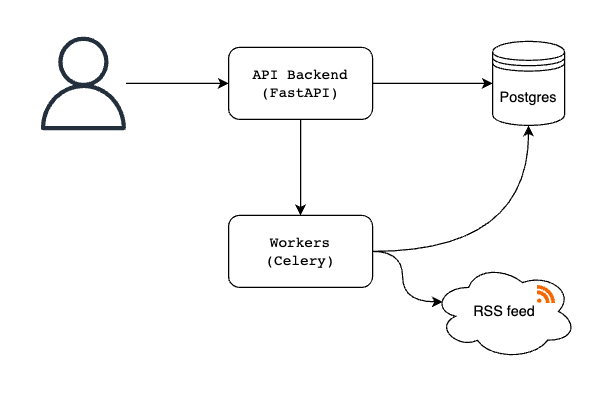

# FeedFuse - Another RSS feed manager

The application is an RSS scraper that extracts RSS feeds and stores them in a database. Users can manage the feeds with REST API.

### Setup

1. Download and unzip the project.
2. Make sure you have Docker installed.
3. Build the Docker images by running the following command in your terminal:
   ```
   make build
   ```
4. Initialize the database by running the following command:
   ```
   make setup-db
   ```
5. Start the Docker containers by running the following command:
   ```
   make run
   ```
   This will start the web application and the worker processes. 

Once the containers are up and running, you can access the API docs in `Swagger UI` by opening a web browser and navigating to `http://localhost:8000/docs`.


### System Design Diagram

This is a solution that allows users to create, subscribe, and unsubscribe from RSS feeds through an API. The backend is based on FastAPI and uses a PostgreSQL database to store user and feed information. A distributed background task manager periodically fetches and processes feed information asynchronously. In case of worker failure, a backoff mechanism prevents updates for a certain period of time, after which users can request an immediate update.

The application should support the following feeds:

- http://www.nu.nl/rss/Algemeen
- https://feeds.feedburner.com/tweakers/mixed

Users of the API should be able to:

- Follow and unfollow multiple feeds
- List all feeds registered by them
- List feed items belonging to one feed
- Mark items as read
- Filter read/unread feed items per feed and globally, ordered by the date of the last update
- Force a feed update




### Database design

Database tables for the RSS feed service:

**User**

Table name: `user`

| Column Name | Data Type | Constraints      | Description                  |
|-------------|-----------|------------------|------------------------------|
| id          | integer   | primary key      | Unique identifier for a user |
| email       | string    | not null, unique | Email address of the user    |
| full_name   | string    | unique           | Full name of the user        |
| password    | string    | not null         | Password of the user         |

**Subscription**

Table name: `subscription`

| Column Name | Data Type | Constraints                       | Description                                               |
|-------------|-----------|-----------------------------------|-----------------------------------------------------------|
| id          | integer   | primary key                       | Unique identifier for a subscription                      |
| user_id     | integer   | foreign key to User(id), not null | Foreign key to the `user` table                           |
| feed_id     | integer   | foreign key to Feed(id), not null | Foreign key to the `feed` table                           |
| is_active   | boolean   | default true                      | Flag indicating whether the subscription is active or not |

**Feed**

Table name: `feed`

| Column Name       | Data Type | Constraints  | Description                                              |
|-------------------|-----------|--------------|----------------------------------------------------------|
| id                | integer   | primary key  | Unique identifier for a feed                             |
| title             | string    | not null     | Title of the feed                                        |
| url               | string    | not null     | URL of the feed                                          |
| description       | string    | not null     | Description of the feed                                  |
| modified_at       | string    | default null | Header from RSS feed to reduce API calls                 |
| last_built_at     | datetime  | default null | Timestamp of the last time the feed was built            |
| is_update_enabled | boolean   | default true | Flag indicating whether updates are enabled for the feed |
| created_at        | datetime  | not null     | Timestamp of when the feed was created                   |

**Item**

Table name: `item`

| Column Name  | Data Type | Constraints                       | Description                              |
|--------------|-----------|-----------------------------------|------------------------------------------|
| id           | integer   | primary key                       | Unique identifier for an item            |
| feed_id      | integer   | foreign key to Feed(id), not null | Foreign key to the `feed` table          |
| title        | string    | not null                          | Title of the item                        |
| url          | string    | not null                          | URL of the item                          |
| guid         | string    | not null                          | Globally unique identifier of the item   |
| description  | string    | default null                      | Description of the item                  |
| published_at | datetime  | not null                          | Timestamp of when the item was published |

**ReadStatus**

Table name: `read_status`

| Column Name | Data Type | Constraints                       | Description                                           |
|-------------|-----------|-----------------------------------|-------------------------------------------------------|
| id          | integer   | primary key                       | Unique identifier for a read status                   |
| user_id     | integer   | foreign key to User(id), not null | Foreign key to the `user` table                       |
| item_id     | integer   | foreign key to Item(id), not null | Foreign key to the `item` table                       |
| is_read     | boolean   | default false                     | Flag indicating whether the item has been read or not |

This schema includes the following:

- **User**: table to store user information, including email, full_name and password.
- **Subscription**: table to store user-subscribed feeds, including the feed id, user id, and an indicator whether the subscription is active or not.
- **Feed**: table to store feed information, including title, url, description, last built date, whether updates are enabled, and created date.
- **Item**: table to store items, including the item id, feed id, title, url, guid, description, and publish date.
- **ReadStatus**: table to store read status of items, including user id, item id, and a flag indicating whether the item has been read or not.

### Improvement Scopes

There are several areas of improvement that need attention:

**Caching:** No caching has been implemented yet.

**Testing:** There is a lack of worker tests, and only integration tests have been performed.

**AsyncIO:** While the rest of the project uses async/await, the distributed task manager Celery does not support async. To work around this issue, boilerplate code has been written, but it may need further optimization.
